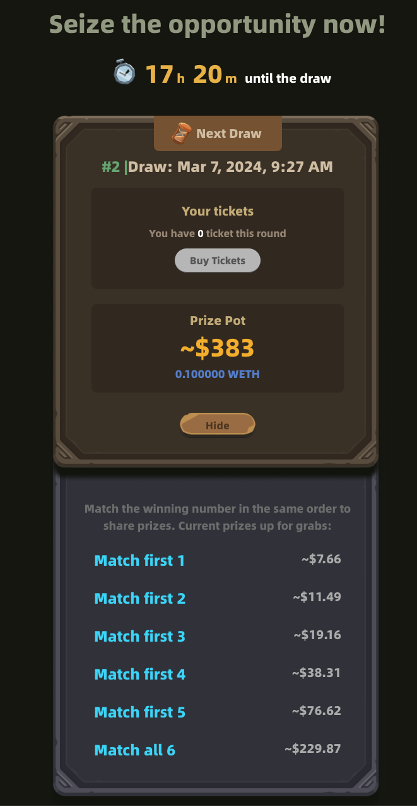
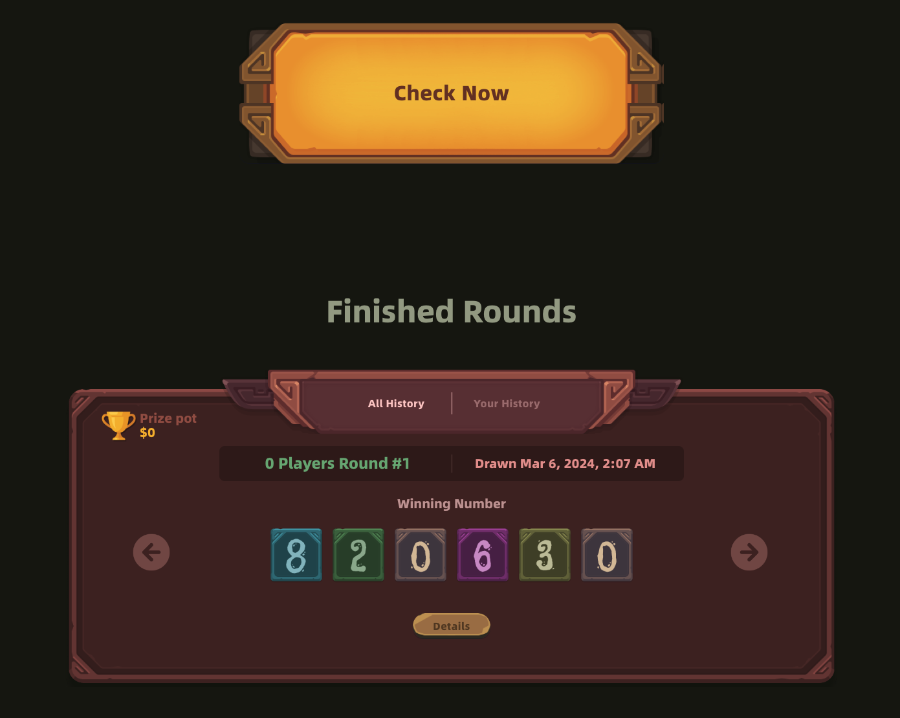

# BlastLotteryV2

## intro

这是在blast主网新上的Lottery项目, 撰文时仅有一次活动. 合约余额 ~300 USD.

### twitter

https://twitter.com/BlastLotteries

### smart contract

- BlastLotteryV2 0x6B394A710249DDA7bd6212Bb9029DD9B3bD1554a

一次 lottey 活动, 需要项目方调用函数 startLottery, closeLottery, drawFinalNumberAndMakeLotteryClaimable.

用户在 lottery 期间会 buyTickets, 结束后会 claimTickets 获取奖励

- PythRandomNumberGenerator 0x3FC505EEB9376c2F81417fc369d22Fc2C7181504

预言机是中心化的, 只能项目方owner reveal随机数

### dapp website

https://app.blalottery.xyz/?chain=blast

